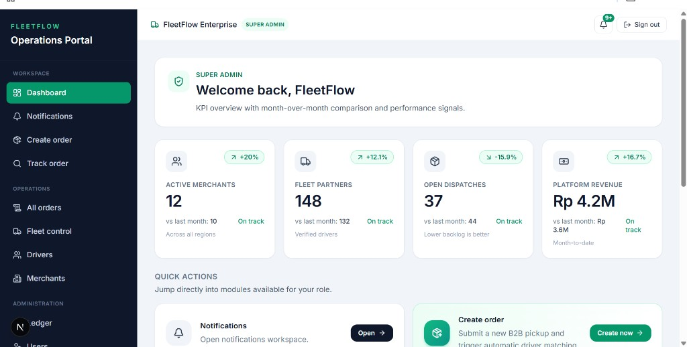
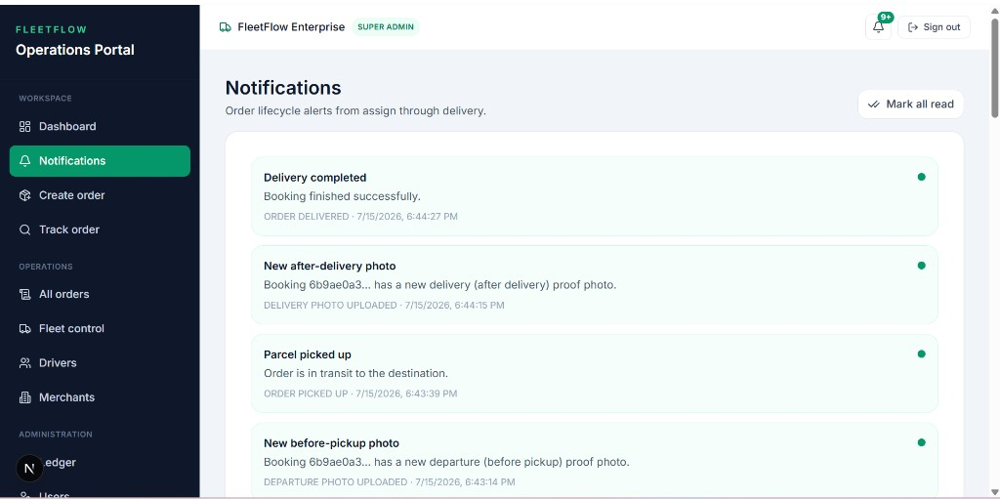
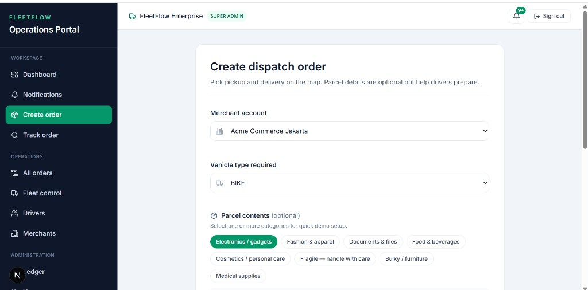
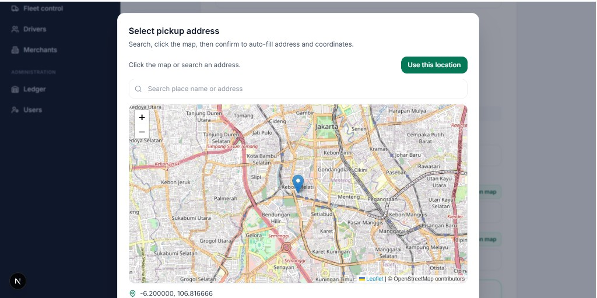
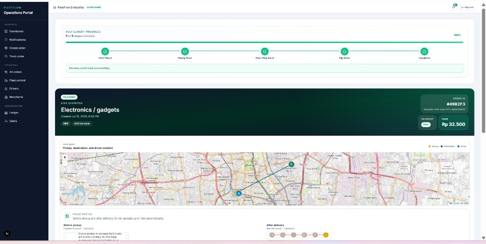
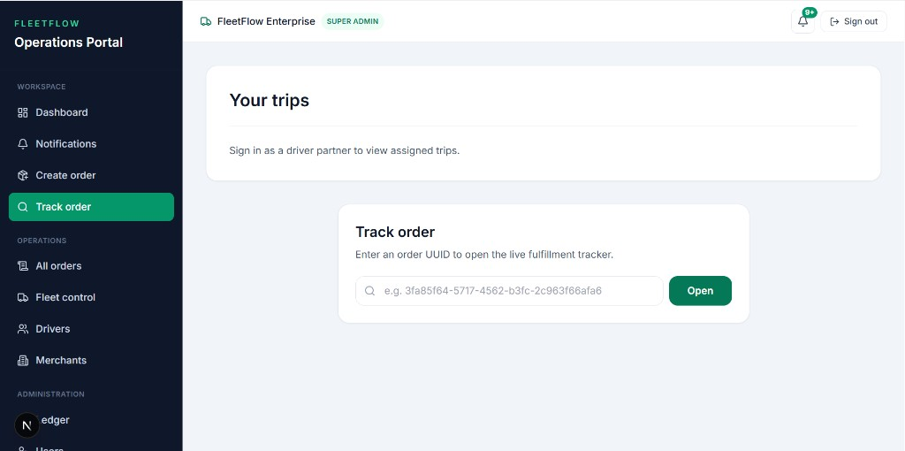
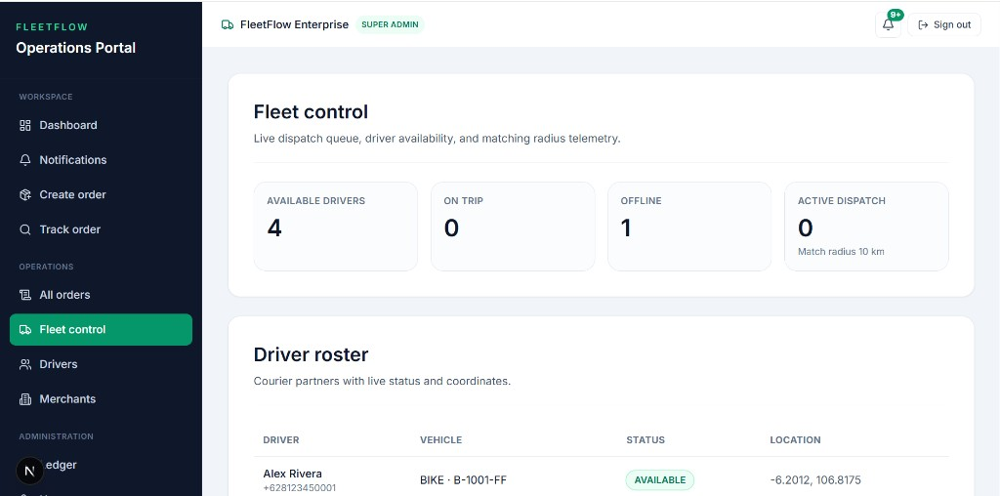
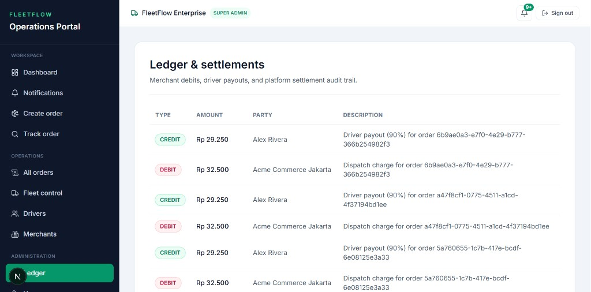

# FleetFlow Web — Visual Preview

Operations portal screenshots (SUPER ADMIN). Use for portfolio reviewers, recruiters, or teammates before running the stack locally.

> **IDE preview:** If images look blank in Cursor/VS Code, reload the window after opening this repo. On **GitHub**, images render automatically.

---

## Dashboard

KPI overview with month-over-month comparisons and quick actions.

---

## Notifications

Order lifecycle alerts (assign → pickup → delivery → proof photos). Booking refs use `#` + last 6 hex chars (e.g. `#4982F3`).

---

## Create order

Merchant, vehicle type, and parcel category tags before map pickup/delivery.

---

## Select pickup address

Leaflet map picker — search or click map, then confirm coordinates.

---

## Order detail + proof photos

Fulfillment stepper, trip map, booking `#XXXXXX`, and before-pickup / after-delivery proof gallery (SSE-synced).

---

## Track order

Open the live fulfillment tracker by order UUID.

---

## Fleet control

Live driver availability, on-trip / offline counts, and roster coordinates.

---

## Ledger & settlements

Merchant debits, driver payouts, and platform settlement audit trail.

---

## Related

| Item | Link |
|------|------|
| Portal README | [../../README.md](../../README.md) |
| E2E demo script | [../../../fleetflow-docs/DEMO_E2E.md](../../../fleetflow-docs/DEMO_E2E.md) |
| Realtime SSE | [../../../fleetflow-docs/REALTIME_SSE.md](../../../fleetflow-docs/REALTIME_SSE.md) |
| Local URL | http://localhost:3001 |
